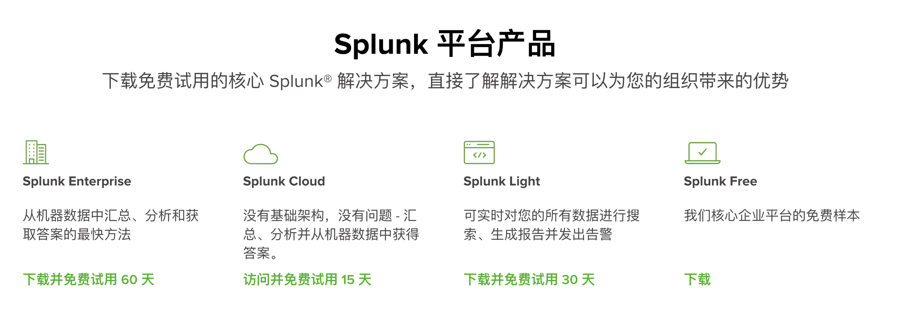

Spark在通信运营商生产环境中的应用案例
---
Spark在通信运营商融合支付系统日志统计分析的综合应用案例。
通过Spark核心计算架构及Splunk大数据Web展示系统在融合支付平台的综合应用，
统计分析通信运营商生产环境中融合支付系统日志中调用外部接口的返回码、系统超时等日志数据。


# 17.1 融合支付系统日志系统分析

### 日志格式
* 融合支付销账失败返回码统计分析：
    

* 销账失败返回码统计分析(设备号对应账号为空)
    .jpeg)

* 到UAM认证系统超时分析：
    

* 到账务计费系统MQ校验订单超时分析：
    
    
* 到账务计费系统MQ账单支付超时分析
    
    
    
### 日志清洗：Scala正则表达式与匹配模式结合
详细查看[rhzfLogRegex.scala](src/main/scala/yore/comm/rhzfLogRegex.scala)


# Splunk工具使用
[Splunk官网](https://www.splunk.com/)，它是一个第三方的运维智能平台，作为第三方的日志文件管理工具，
其重要功能包括日志聚合、搜索、字段提取、数据格式化、可视化、电子邮件提醒。

Splunk有Splunk Enterprise【企业版】、Splunk Free【免费版】、Splunk Cloud、Splunk Hunk【大数据分析平台】、Splunk Apps【基于企业版的插件】等，
企业版按索引的数据量收费，免费版每天最大数据索引量500MB，可使用绝大多数企业版功能。
SplunkEnterprise 添加了支持多用户和分布式部署的功能，并包括警报、基于角色的安全、单一登录、预设的 PDF 交付以及对无限数据量的支持。 
默认下载的是 60 天 Enterprise 试用版， 60 天试用之后将自动转化为 Free 版，转化位 Free 版后每日处理的日志量最高位 500M 。


#### 1、下载
你可以使用浏览器访问 http://zh-hans.splunk.com/download下载最新版的 Splunk。如果你是第一次访问 Splunk 网站，需要先注册一个 Splunk 用户，
下载之前需要我们先注册用户，
  
```
First Name：    Yore
Last Name:      Yuan
Job Title:      bigdata
Email Address   yuandd_yore@163.com
Phone Number    173**
Company         gbicc
China
Zip/Postal Code
Username        YoreYuan
Password        Suyuexi&123     #8位以上；有大小写；有数字；有符号
I agree to the Splunk Website Terms & Conditions of Use.

Create Your Account

```

开始安装
```
## 防火墙
systemctl statusfirewalld.service
firewall-cmd --state

./splunk start --accept-license       启动并自动接收许可
./splunk restart                    重启
./splunk status                    查看状态
./splunk version                   查看版本

./splunk enable boot-start      配置splunk开机启动

./splunk disable boot-start          关闭自动启动
./splunk stop                      停止服务
./rm-rf/splunk                      移除安装目录

```
splunk安装之后开启Splunk Web端口8000，我们可以在浏览器中访问splunk 8000端口的WEB界面http://192.168.3.133:8000。
注：进入splunk默认的管理员为：admin ，密码为changeme，第一登录便会强制要求修改密码。

Splunkd端口8089端为管理端口。


##### 官方文档
[安装文档](http://docs.splunk.com/Documentation/Splunk/latest/Installation/Whatsinthismanual)
[快速参考指南](https://www.splunk.com/pdfs/solution-guides/splunk-quick-reference-guide.pdf)
[电子学习教程](https://www.splunk.com/view/SP-CAAAH9U)
[Splunk Enterprise 文档](http://docs.splunk.com/Documentation/Splunk)
[简体中文版手册](https://docs.splunk.com/Documentation/Splunk/7.2.5/Translated/SimplifiedChinesemanuals)


### Splunk可视化展示
https://blog.51cto.com/215687833/1762344 

通过上一步分析可以得到过滤后的日志数据文件。  


****

Spark 在光宽用户流量热力分布GIS系统中的综合应用案例
---

### 光宽用户流量热力分布GIS应用的数据说明
光宽用户流量热力分布GIS应用数据源包括：  
* PON 口的流量数据
* 光网络设备的经纬度位置信息
  
特大型城市通信运营商从现网运行网络设备上采集无缘光前网络设备端口 PON口的流量数据，
PON口流量数据的格式描述如下：
```
端口类型 PonPort
区局 区局名称
OLT名称 分局T1/ZTEC300-OLT04
PON口编号 epon_1/2/4
采集时间 201701071458- 2.01604E+11
入向峰值 6.17308
入向平均值 4.3376384
出向峰值 15.217123
出向平均值 5.3401234

例：
PonPort, 宝山, 宝山冰冠北楼 R1/HW5680T-OLT01, EPON 0/1/5, 201701302058-201703302210, 0, 0, 0.22320748, 0.063800128
```

光网络设备的位置信息`OLTPORT_LOCATION`存放在特大型城市通信运营商大数据平台的Hive中。
```
hive> desc OLTPORT_LOCATION
olt_port        string      端口信息
ad_location     string      olt经纬度(按:分割)

例：
崇明港沿T1/ZTEC500-OLT04|03|07  124.670679:31.591234
南汇惠南D1/ZTEC220-OLT01|05|04  124.750808:31.041234
松江方塔T1/ZTEC600-OLT11|02|07  124.243126:31.002079
奉贤肖塘D1/HW5680T-OLT07|01|03  122.458160:30.971234
黄兴Z1/ZTEC220-OLT05|01|04     121.430594:41.801234
长宁T1/HW5680T-OLT04|08|02     121.426483:31.225152
海宁T2/HW5680T-OLT38|03|00     124.455410:31.258940
江苏T2/HW5680T-OLT11|03|02     122.442038:31.222126
```


### 热力分布GIS应用Spark实战
整体流程：

  
从Hadoop分布式文件系统中读入PON口的流量数据进行Row行数据格式化。
PON口流量数据的每行数据包括端口类型、区局名称、设备端口号、采集事假、入向峰值、入向平均值、出向峰值、出向平均值。  


----
Splunk
===

可以利用Splunk实时地监控数据，或者在海量事实中进行数据挖掘。
Splunk的地理位置功能支持在地图上显示数据。  

比如可以：
* 监控社会媒体，并从中挖掘影响业务的趋势
* 了解客户对产品的评价，以及客户评价的实时动态
* 挖掘的业务数据中监测不断变化的客户行为
* 收集并分析实时数据和历史数据
* 通过基本的分析指标更好地理解数据
* 创建有说服力的可视化图表，展示数据挖掘结果


