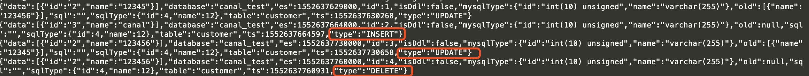
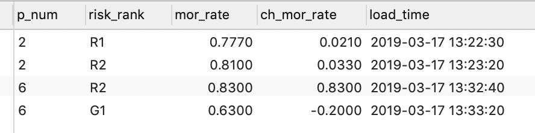

基于Spark Streaming + Canal + Kafka对Mysql增量数据实时进行监测分析
===
Spark中的Spark Streaming可以用于实时流项目的开发，
实时流项目的数据源除了可以来源于日志、文件、网络端口等，常常也有这种需求，那就是实时分析处理MySQL中的增量数据。
面对这种需求当然我们可以通过JDBC的方式定时查询Mysql，然后再对查询到的数据进行处理也能得到预期的结果，
但是Mysql往往还有其他业务也在使用，这些业务往往比较重要，通过JDBC方式频繁查询会对Mysql造成大量无形的压力，
甚至可能会影响正常业务的使用，在基本不影响其他Mysql正常使用的情况下完成对增量数据的处理，那就需要Canal了。
  
假设Mysql中`canal_test`库下有一张表`policy_cred`，需要统计实时统计policy_status状态为1的mor_rate的的变化趋势，
并标注比率的风险预警等级。

# 1. Canal
Canal \[kə'næl] 是阿里巴巴开源的纯java开发的基于数据库binlog的增量订阅&消费组件。
Canal的原理是模拟为一个Mysql slave的交互协议，伪装自己为MySQL slave，向Mysql Master发送dump协议，
然后Mysql master接收到这个请求后将binary log推送给slave(也就是Canal)，Canal解析binary log对象。
详细可以查阅Canal的官方文档[alibaba/canal wiki](https://github.com/alibaba/canal/wiki)  


## 1.1 Canal 安装
Canal的server mode在1.1.x版本支持的有TPC、[Kafka](https://github.com/apache/kafka)、
[RocketMQ](https://github.com/apache/rocketmq)。本次安装的canal版本为1.1.2，Canal版本最后在1.1.1之后。server端采用MQ模式，
MQ选用Kafka。服务器系统为Centos7，其他环境为：jdk8、Scala 2.11、Mysql、Zookeeper、Kafka。  

### 1.1.1 准备
安装Canal之前我们先把如下安装好
+ Mysql  
    - a. 如果没有Mysql: 详细的安装过程可参考我的另一篇博客[Centos7环境下离线安装mysql 5.7 / mysql 8.0](https://blog.csdn.net/github_39577257/article/details/77433996)  
    - b. 开启Mysql的binlog。修改/etc/my.cnf，在\[mysqld]下**添加**如下配置，改完之后重启Mysql`/etc/init.d/mysql restart`
        ```bash
        [mysqld]
        #添加这一行就ok
        log-bin=mysql-bin
        #选择row模式
        binlog-format=ROW
        #配置mysql replaction需要定义，不能和canal的slaveId重复
        server_id=1 
        ```
    - c. 创建一个Mysql用户并辅以响应权限，用于Canal使用
        ```bash
        mysql>  CREATE USER canal IDENTIFIED BY 'canal';  
        mysql>  GRANT SELECT, REPLICATION SLAVE, REPLICATION CLIENT ON *.* TO 'canal'@'%';
        mysql>  GRANT ALL PRIVILEGES ON *.* TO 'canal'@'%' ;
        mysql>  FLUSH PRIVILEGES;
        ```    
+ Zookeeper
    因为安装Kafka时需要Zookeeper，例如ZK安装后地址为：`cdh3:2181,cdh4:2181,cdh5:2181`

+ Kafka
    - 例如安装后的地址为：`node1:9092,node2:9092,node3:9092`
    - 安装后创建一个Topic，例如创建一个**example**
    ```bash
    kafka-topics.sh --create --zookeeper cdh3:2181,cdh4:2181,cdh5:2181 --partitions 2 --replication-factor 1 --topic example
    ```
    
    
### 1.1.2 安装Canal
1. 下载Canal  
    访问Canal的Release页[canal v1.1.2](https://github.com/alibaba/canal/releases/tag/canal-1.1.2)
    ```bash
    wget https://github.com/alibaba/canal/releases/download/canal-1.1.2/canal.deployer-1.1.2.tar.gz
    ```
2. 解压  
    **注意**这里一定要先创建出一个目录，直接解压会覆盖文件
    ```bash
    mkdir -p /usr/local/canal
    mv canal.deployer-1.1.2.tar.gz /usr/local/canal/
    tar -zxvf canal.deployer-1.1.2.tar.gz
    ```
3. 修改instance 配置文件  
    vim $CANAL_HOME/conf/example/instance.properties，修改如下项，其他默认即可
    ```bash
    ## mysql serverId , v1.0.26+ will autoGen ， 不要和server_id重复
    canal.instance.mysql.slaveId=3
    
    # position info。Mysql的url
    canal.instance.master.address=node1:3306
    
    # table meta tsdb info
    canal.instance.tsdb.enable=false
    
    # 这里配置前面在Mysql分配的用户名和密码
    canal.instance.dbUsername=canal
    canal.instance.dbPassword=canal
    canal.instance.connectionCharset=UTF-8
    # 配置需要检测的库名，可以不配置，这里只检测canal_test库
    canal.instance.defaultDatabaseName=canal_test
    # enable druid Decrypt database password
    canal.instance.enableDruid=false
    
    # 配置过滤的正则表达式，监测canal_test库下的所有表
    canal.instance.filter.regex=canal_test\\..*
    
    # 配置MQ
    ## 配置上在Kafka创建的那个Topic名字
    canal.mq.topic=example
    ## 配置分区编号为1
    canal.mq.partition=1
    
    ```

4. 修改canal.properties配置文件  
    vim $CANAL_HOME/conf/canal.properties，修改如下项，其他默认即可
    ```bash
    # 这个是如果开启的是tcp模式，会占用这个11111端口，canal客户端通过这个端口获取数据
    canal.port = 11111
    
    # 可以配置为：tcp, kafka, RocketMQ，这里配置为kafka
    canal.serverMode = kafka
    
    # 这里将这个注释掉，否则启动会有一个警告
    #canal.instance.tsdb.spring.xml = classpath:spring/tsdb/h2-tsdb.xml
    
    ##################################################
    ######### 		     MQ 		     #############
    ##################################################
    canal.mq.servers = node1:9092,node2:9092,node3:9092
    canal.mq.retries = 0
    canal.mq.batchSize = 16384
    canal.mq.maxRequestSize = 1048576
    canal.mq.lingerMs = 1
    canal.mq.bufferMemory = 33554432
    # Canal的batch size, 默认50K, 由于kafka最大消息体限制请勿超过1M(900K以下)
    canal.mq.canalBatchSize = 50
    # Canal get数据的超时时间, 单位: 毫秒, 空为不限超时
    canal.mq.canalGetTimeout = 100
    # 是否为flat json格式对象
    canal.mq.flatMessage = true
    canal.mq.compressionType = none
    canal.mq.acks = all
    # kafka消息投递是否使用事务
    #canal.mq.transaction = false
    
    ```

5. 启动Canal
    ```bash
    $CANAL_HOME/bin/startup.sh
    ```
    
6. 验证
* 查看日志    
    * 启动后会在logs下生成两个日志文件：logs/canal/canal.log、logs/example/example.log，查看这两个日志，保证没有报错日志。
    * 如果是在虚拟机安装，最好给2个核数以上。
    * 确保登陆的系统的hostname可以ping通。
    
* 在Mysql数据库中进行增删改查的操作，然后查看Kafka的topic为example的数据
    ```bash
     kafka-console-consumer.sh --bootstrap-server node1:9092,node2:9092,node3:9092 --from-beginning --topic example
    ```
    

7. 关闭Canal  
不用的时候一定要通过这个命令关闭，如果是用kill或者关机，当再次启动依然会提示要先执行stop.sh脚本后才能再启动。
    ```bash
    $CANAL_HOME/bin/stop.sh
    ```


## *1.2 Canal 客户端代码
如果我们不使用Kafka作为Canal客户端，我们也可以用代码编写自己的Canal客户端，然后在代码中指定我们的数据去向。  
此时只需要将canal.properties配置文件中的canal.serverMode值改为tcp。编写我们的客户端代码。

在Maven项目的pom中引入：
```xml
<dependency>
    <groupId>com.alibaba.otter</groupId>
    <artifactId>canal.client</artifactId>
    <version>1.1.2</version>
</dependency>
```
  
编写代码：
```java
/**
 * Canal客户端。
 *  注意：canal服务端只会连接一个客户端，当启用多个客户端时，其他客户端是就无法获取到数据。所以启动一个实例即可
 * 
 * @see <a href="https://github.com/alibaba/canal/wiki/ClientExample">官方文档：ClientSample代码</a>
 *
 * Created by yore on 2019/3/18 10:50
 */
public class SimpleCanalClientExample {
    
    public static void main(String args[]) {
    
        /**
         * 创建链接
         *      SocketAddress: 如果提交到canal服务端所在的服务器上运行这里可以改为 new InetSocketAddress(AddressUtils.getHostIp(), 11111)
         *      destination 通服务端canal.properties中的canal.destinations = example配置对应
         *      username：
         *      password：
         */
        CanalConnector connector = CanalConnectors.newSingleConnector(
                new InetSocketAddress("node1", 11111),
                "example", "", "");
        int batchSize = 1000;
        int emptyCount = 0;
        try {
            connector.connect();
            connector.subscribe(".*\\..*");
            connector.rollback();
            int totalEmptyCount = 120;
            while (emptyCount < totalEmptyCount) {
                Message message = connector.getWithoutAck(batchSize); // 获取指定数量的数据
                long batchId = message.getId();
                int size = message.getEntries().size();
                if (batchId == -1 || size == 0) {
                    emptyCount++;
                    System.out.println("empty count : " + emptyCount);
                    try {
                        Thread.sleep(1000);
                    } catch (InterruptedException e) {
                    }
                } else {
                    emptyCount = 0;
                    // System.out.printf("message[batchId=%s,size=%s] \n", batchId, size);
                    printEntry(message.getEntries());
                }

                connector.ack(batchId); // 提交确认
                // connector.rollback(batchId); // 处理失败, 回滚数据
            }

            System.out.println("empty too many times, exit");
        } finally {
            connector.disconnect();
        }
    }

    private static void printEntry(List<Entry> entrys) {
        for (Entry entry : entrys) {
            if (entry.getEntryType() == EntryType.TRANSACTIONBEGIN || entry.getEntryType() == EntryType.TRANSACTIONEND) {
                continue;
            }

            RowChange rowChage = null;
            try {
                rowChage = RowChange.parseFrom(entry.getStoreValue());
            } catch (Exception e) {
                throw new RuntimeException("ERROR ## parser of eromanga-event has an error , data:" + entry.toString(),
                        e);
            }

            EventType eventType = rowChage.getEventType();
            System.out.println(String.format("================&gt; binlog[%s:%s] , name[%s,%s] , eventType : %s",
                    entry.getHeader().getLogfileName(), entry.getHeader().getLogfileOffset(),
                    entry.getHeader().getSchemaName(), entry.getHeader().getTableName(),
                    eventType));
            
            /**
             * 如果只对某些库的数据操作，可以加如下判断：
             * if("库名".equals(entry.getHeader().getSchemaName())){
             *      //TODO option
             *  }
             * 
             * 如果只对某些表的数据变动操作，可以加如下判断：
             * if("表名".equals(entry.getHeader().getTableName())){
             *     //todo option
             * }
             * 
             */

            for (RowData rowData : rowChage.getRowDatasList()) {
                if (eventType == EventType.DELETE) {
                    printColumn(rowData.getBeforeColumnsList());
                } else if (eventType == EventType.INSERT) {
                    printColumn(rowData.getAfterColumnsList());
                } else {
                    System.out.println("-------&gt; before");
                    printColumn(rowData.getBeforeColumnsList());
                    System.out.println("-------&gt; after");
                    printColumn(rowData.getAfterColumnsList());
                }
            }
        }
    }

    private static void printColumn(List<Column> columns) {
        for (Column column : columns) {
            System.out.println(column.getName() + " : " + column.getValue() + "    update=" + column.getUpdated());
        }
    }
    
}
```

本地运行上述代码，我们修改Mysql数据中的数据，可在控制台中看到数据的改变：
```
empty count : 20
empty count : 21
empty count : 22
================&gt; binlog[mysql-bin.000009:1510] , name[canal_test,customer] , eventType : INSERT
id : 4    update=true
name : spark    update=true
empty count : 1
empty count : 2
empty count : 3
```


# 2. Spark 
通过上一步我们已经能够获取到canal_test库的变化数据，并且已经可将将变化的数据实时推送到Kafka中，Kafka中接收到的数据是一条Json格式的数据，
我们需要对INSERT和UPDATE类型的数据处理，并且只处理状态为1的数据，然后需要计算mor_rate的变化，
并判断mor_rate的风险等级，0-75%为G1等级，75%-80%为R1等级，80%-100%为R2等级。
最后将处理的结果保存到DB，可以保存到Redis、Mysql、MongoDB，或者推送到Kafka都可以。

## 2.1 在Mysql中创建如下两张表：
```sql
-- 在canal_test库下创建表
CREATE TABLE `policy_cred` (
	p_num varchar(22) NOT NULL,
	policy_status varchar(2) DEFAULT NULL COMMENT '状态：0、1',
	mor_rate decimal(20,4) DEFAULT NULL,
	load_time datetime DEFAULT NULL,
	PRIMARY KEY (`p_num`)
) ENGINE=InnoDB DEFAULT CHARSET=utf8;

-- 在real_result库下创建表
CREATE TABLE `real_risk` (
	p_num varchar(22) NOT NULL,
	risk_rank varchar(8) DEFAULT NULL COMMENT '等级：G1、R1、R2',
	mor_rate decimal(20,4) ,
	ch_mor_rate decimal(20,4),
	load_time datetime DEFAULT NULL
) ENGINE=InnoDB DEFAULT CHARSET=utf8;
```

```json
{
  "data": null,
  "database": "canal_test",
  "es": 1552664727000,
  "id": 3,
  "isDdl": true,
  "mysqlType": null,
  "old": null,
  "sql": "CREATE TABLE `policy_cred` (\n\tp_num varchar(22) NOT NULL,\n\tpolicy_status varchar(2) DEFAULT NULL COMMENT '状态',\n\tmor_rate decimal(20,4) DEFAULT NULL,\n\tload_time datetime DEFAULT NULL,\n\tPRIMARY KEY (`p_no`)\n) ENGINE=InnoDB DEFAULT CHARSET=utf8",
  "sqlType": null,
  "table": "policy_cred",
  "ts": 1552664727440,
  "type": "CREATE"
}
```


## 2.2 Spark代码开发：
[M_PolicyCreditApp](src/main/scala/yore/spark/M_PolicyCreditApp.scala)


# 3. 测试
启动ZK、Kafka、Canal。
在canal_test库下的policy_cred表中插入或者修改数据，
然后查看real_result库下的real_risk表中结果。

* 更新一条数据时Kafka接收到的json数据如下：
```json
{
  "data": [
    {
      "p_num": "1",
      "policy_status": "1",
      "mor_rate": "0.8800",
      "load_time": "2019-03-19 12:54:57"
    }
  ],
  "database": "canal_test",
  "es": 1552698141000,
  "id": 10,
  "isDdl": false,
  "mysqlType": {
    "p_num": "varchar(22)",
    "policy_status": "varchar(2)",
    "mor_rate": "decimal(20,4)",
    "load_time": "datetime"
  },
  "old": [
    {
      "mor_rate": "0.5500"
    }
  ],
  "sql": "",
  "sqlType": {
    "p_num": 12,
    "policy_status": 12,
    "mor_rate": 3,
    "load_time": 93
  },
  "table": "policy_cred",
  "ts": 1552698141621,
  "type": "UPDATE"
}
```


# 4. 查看Mysql中的结果表



# 5. 依赖包中出现冲突的问题解决：
例如项目中出现错误：
```
Exception in thread "main" java.lang.NoSuchMethodError: io.netty.buffer.PooledByteBufAllocator.<init>(ZIIIIIIIZ)V
	at org.apache.spark.network.util.NettyUtils.createPooledByteBufAllocator(NettyUtils.java:120)
	at org.apache.spark.network.client.TransportClientFactory.<init>(TransportClientFactory.java:106)
	at org.apache.spark.network.TransportContext.createClientFactory(TransportContext.java:99)
	at org.apache.spark.rpc.netty.NettyRpcEnv.<init>(NettyRpcEnv.scala:71)
	at org.apache.spark.rpc.netty.NettyRpcEnvFactory.create(NettyRpcEnv.scala:461)
	at org.apache.spark.rpc.RpcEnv$.create(RpcEnv.scala:57)
	at org.apache.spark.SparkEnv$.create(SparkEnv.scala:249)
	at org.apache.spark.SparkEnv$.createDriverEnv(SparkEnv.scala:175)
	at org.apache.spark.SparkContext.createSparkEnv(SparkContext.scala:257)
	at org.apache.spark.SparkContext.<init>(SparkContext.scala:424)
	at org.apache.spark.streaming.StreamingContext$.createNewSparkContext(StreamingContext.scala:838)
	at org.apache.spark.streaming.StreamingContext.<init>(StreamingContext.scala:85)
	at yore.spark.M_PolicyCreditApp$.main(M_PolicyCreditApp.scala:33)
	at yore.spark.M_PolicyCreditApp.main(M_PolicyCreditApp.scala)
```

我们可以在项目的根目录下的命令窗口中输人：`mvn dependency:tree -Dverbose> dependency.log`

然后可以在项目根目录下生产一个dependency.log文件，查看这个文件，在文件中搜索 io.netty 关键字，找到其所在的依赖包：

然就在canal.client将io.netty排除掉


